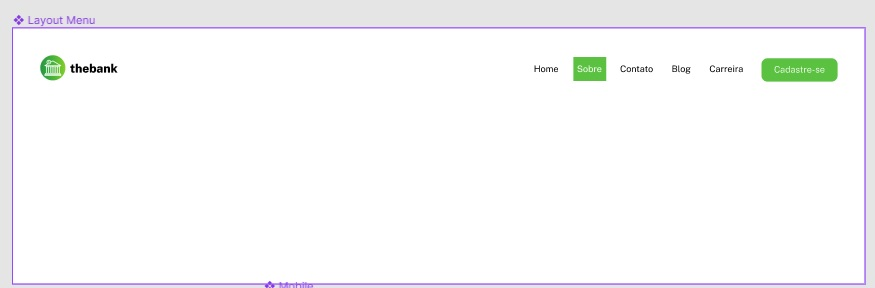
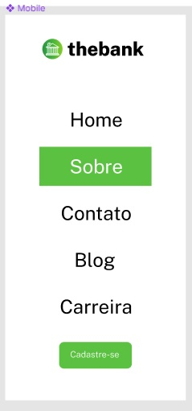
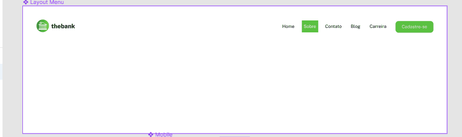

# README - Exercício Avançado CSS - FLEX - 01
Estudo de caso FLEX. Desenvolvimento de Layout de Site de Instituição Bancária. Usamos no projeto linguagem HTML e CSS. Fizemos um projeto responsivo, levando-se em consideração o uso do mesmo site em dispositivos móveis ou dispositivos com telas pequenas. 🚀🚀 

Abaixo estão as imagens e gif´s do site que foi reproduzido.

[]

[]

## Tecnologias Utilizadas
- HTML
- CSS
